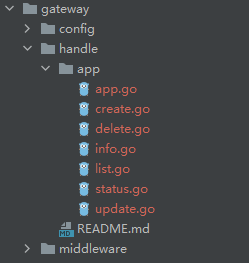

# jingxiu web服务开发脚手架
version: v0.1.7  

### 安装
```shell
go install github.com/jingxiu1016/jingxiu@v0.1.6
```
验证：%GOROOT%/bin目录下能找到jingxiu.exe即安装成功

1. 开始一个项目
   ```shell
    jingxiu start ${project-name}
    ```
   示例：
   ```shell
   jingxiu start jingxiu-intro
   ```
   执行之上的命令会在当前目录下生成一个名为**jingxiu-intro**的文件夹，这就是整个项目工程的工作空间。
   
   **!** 建议在GOPATH目录下执行命令
   
   目录示览
   
   
2. 创建一个应用
    ```shell
    jingxiu create ${controller-name} ${interface-name}
    ```
   目前支持的基准API接口
   - APIHandler
   - ...待开发
   
   示例：
   ```shell
   jingxiu create app APIHandler
   ```
   此命令需要在jingxiu-intro的工作空间内执行。
   
   并会在jingxiu-intro/gateway/handle目录下创建一个名为app的文件夹，其内文件包含了业务控制器，以及生成的接口文件，开发人员仅需编写业务逻辑代码。
   
   
   开发人员需要注意填写接口注释，用以后面导出路由文件
   
3. 增加一个接口文件
   ```shell
   jingxiu handle ${controller-name} ${interface-name} 
   ```
   
   示例：
   ```shell
   jingxiu handle app register 
   ```
   此命令需要存在相应的控制器。 并在对应的控制器下生成名为register的文件

   
4. 生成数据库模型
    ```shell
    jingxiu model
    ```
   此命令需要在jingxiu-intro/gateway/gateway.yaml配置文件中填写数据库链接的地址，并自动读取数据库所有表，生成对应的DAO层代码，供开发人员采用
5. 路由导出
    ```shell
    jingxiu route [append ${controller-name}]
    ```
   此命令和在jingxiu-intro/gateway/router目录下生成各控制器对应的路由文件
   且各控制器的路由是自动挂载的，无需由开发人员编写。